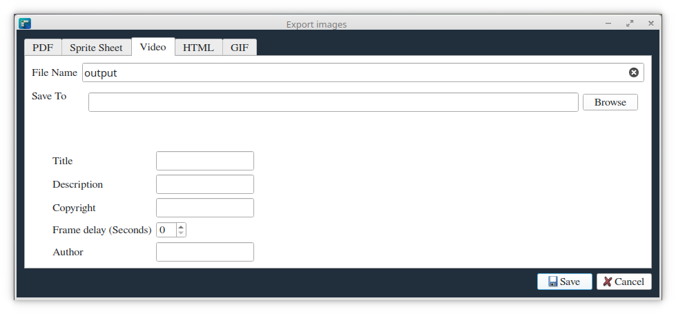
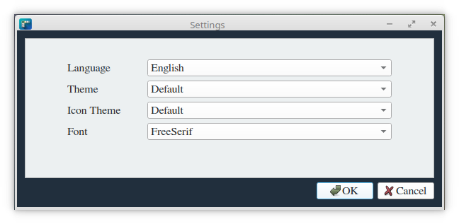

# FrameFlow

FrameFlow is a versatile Qt C++ application designed to transform series of images into various multimedia formats. With FrameFlow, you can easily create videos, PDFs, sprite images, GIFs, and HTML presentations from your image sequences. Whether you're a designer, animator, or content creator, FrameFlow streamlines your workflow for efficient and creative visual storytelling.

## Features

- **Multiple Output Formats**: Convert image sequences to videos, PDFs, sprite images, GIFs, and HTML presentations.
- **Batch Processing**: Handle multiple image series efficiently.
- **Customizable Settings**: Adjust frame rates, resolutions, and other parameters to suit your needs.
- **User-Friendly Interface**: Intuitive Qt-based design for easy navigation and operation.

## Installation

(Please provide specific installation instructions for your Qt C++ application)

## Usage

(Please provide specific usage instructions for FrameFlow)

## Examples

Here are some examples of what you can create with FrameFlow:

| Video | PDF | GIF | HTML Photo gallery  |
|:-----:|:---:|:---:| :-----------------: |
|  | |  |  |

## Requirements

- Qt (version 6.0 or higher)
- FFmpeg (for video processing)
    * libavformat
    * libavcodec
    * libavutil
    * libswscale

## License

This project is licensed under the GNU General Public License (GPL). See the [LICENSE](LICENSE) file for details.

## Acknowledgments

- This application uses FFmpeg for video processing.
- GIF encoding powered by [gif-h](https://github.com/charlietangora/gif-h)
- Thanks to all the contributors who have helped shape FrameFlow.
- Material Icons by Google (https://fonts.google.com/icons) used under Apache License 2.0.
- Special thanks to the open-source communities of the libraries we use.

## Copyright

Copyright © 2024 vivx_developer (https://github.com/Vivx701/FrameFlow)

---

Developed with ❤️ by vivx_developer
